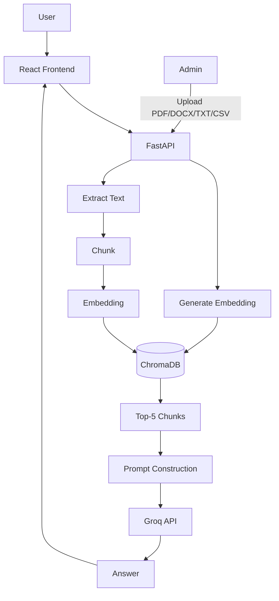

# AI Workforce Assistant Platform

A workforce analytics platform combining a **RAG-based AI chatbot** (ChromaDB +
Groq), embedded **Power BI dashboards**, a **CSV data viewer**, and a secure
**admin-only console** for managing everything — documents, team, dashboards,
and other admins.

```
ai-workforce-platform/
├── backend/     FastAPI + ChromaDB + Groq (RAG, auth, admin APIs)
└── frontend/    React + Vite + Tailwind (public site + admin console)
```

## Architecture

**RAG chatbot flow** (exactly as specified):

```
User Question → React → FastAPI → Generate Embedding → Search ChromaDB
→ Top 5 Chunks → Prompt → Groq API → Answer → React
```

**Admin document ingestion flow:**

```
Admin uploads PDF/DOCX/TXT/CSV → Extract Text → Chunk → Embedding → Store in ChromaDB
```



## Pages

**Public**
| Page | Route | Description |
|---|---|---|
| Home | `/` | Project overview, architecture, tech stack, team, supporting documents, page links |
| AI Assistant | `/assistant` | RAG chatbot grounded in admin-uploaded documents, with suggested questions |
| Power BI Dashboards | `/dashboards` | Embedded Power BI dashboards |
| Data Viewer | `/data-viewer` | Paginated table view of uploaded CSV datasets |
| Admin Login | `/login` | Admin-only sign-in |

**Admin console** (each on its own route, behind login)
| Page | Route | Description |
|---|---|---|
| Recommendations | `/admin` | AI-generated, data-grounded leadership recommendations |
| Documents | `/admin/documents` | Upload/view/edit-category/delete knowledge-base documents |
| Team Members | `/admin/team` | Manage the landing page's team contributions |
| Power BI Links | `/admin/powerbi` | Add/edit/hide/delete embedded dashboard links |
| Decision Assistant | `/admin/assistant` | Recommendation-focused RAG chatbot with analytics suggested questions |
| Manage Admins | `/admin/admins` | Add/update/remove admin accounts (super-admin only) |
| My Profile | `/admin/profile` | Update name, email, password |

## Technology

| Layer | Stack |
|---|---|
| Frontend | React 18, Vite 8, Tailwind CSS 4, react-router-dom, axios, lucide-react |
| Backend | FastAPI, SQLAlchemy, Pydantic v2 |
| RAG | ChromaDB (vector store), Sentence Transformers (local embeddings), **Groq API** (LLM) |
| Extraction | pypdf, python-docx, pandas (CSV) |
| Auth | JWT (PyJWT) + bcrypt, admin-only |

## Quick Start

### 1. Backend

```bash
cd backend
python3.12 -m venv .venv && source .venv/bin/activate
pip install -r requirements.txt
cp .env.example .env
```

Edit `.env`:
- `GROQ_API_KEY` — get a free key at https://console.groq.com/keys
- Everything else has a working local default (SQLite DB, local ChromaDB, local embeddings)

```bash
uvicorn app.main:app --reload --host 0.0.0.0 --port 8000
```

On first run, an admin account is auto-seeded from `.env`:
- Email: `INITIAL_ADMIN_EMAIL` (default `info@gu-saurabh.site`)
- Password: `INITIAL_ADMIN_PASSWORD` (default `change_this_password` — **change this in `.env` before first run**)

API docs: `http://localhost:8000/docs`

### 2. Frontend

```bash
cd frontend
npm install
npm run dev
```

Opens at `http://localhost:5173`, proxying `/api` and `/health` to the backend on port 8000.

## Environment Variables (backend/.env)

See `backend/.env.example` for the full list. Key ones:

| Variable | Purpose |
|---|---|
| `GROQ_API_KEY` | Required for the RAG chatbot and recommendations to answer |
| `GROQ_MODEL` | Default `openai/gpt-oss-20b` |
| `EMBEDDING_MODEL` | Default `sentence-transformers/all-MiniLM-L6-v2` (local, no API key needed) |
| `CHROMA_PERSIST_DIR` | Where ChromaDB stores its index |
| `DATABASE_URL` | Admin/team/PowerBI/document metadata DB (SQLite by default) |
| `JWT_SECRET_KEY` | **Change this** before any real deployment |
| `INITIAL_ADMIN_EMAIL` / `INITIAL_ADMIN_PASSWORD` | First-run admin seed |

## Security

- Only admin accounts can sign in — there is no public user auth on this platform.
- JWT-based sessions; every admin-management, document-management, and
  PowerBI-link-management route requires a valid admin token.
- Only **super admins** can add/remove/promote other admins; safety rails
  prevent an admin from deleting themselves or deleting the last active admin.
- Passwords are hashed with bcrypt (never stored or logged in plaintext).
- Document listing for the public landing page (`/api/documents/public`)
  exposes only filename/type/category — never uploader email or extracted content.
- CSV/Data Viewer read endpoints are intentionally public (page 4 of the
  public site); uploading/deleting datasets remains admin-only.

## Testing

```bash
cd backend
pytest tests/ -v
```

25 tests, all runnable offline (fake embedder, mocked Groq calls — no
network or real API key required), covering: auth, admin management
(including safety rails), team/PowerBI CRUD, document upload → ChromaDB
ingestion, and the full chat query → retrieval → citation flow.

```bash
cd frontend
npm run build
```

## Deployment Notes

- Power BI links should be **"Publish to web"** embed URLs (or a secure
  embed URL from your organization's Power BI setup) — paste them into
  Admin → Power BI Links.
- Swap `DATABASE_URL` to PostgreSQL for production (`postgresql+psycopg2://...`);
  SQLAlchemy handles both identically.
- Change `JWT_SECRET_KEY` and the initial admin password before deploying.
